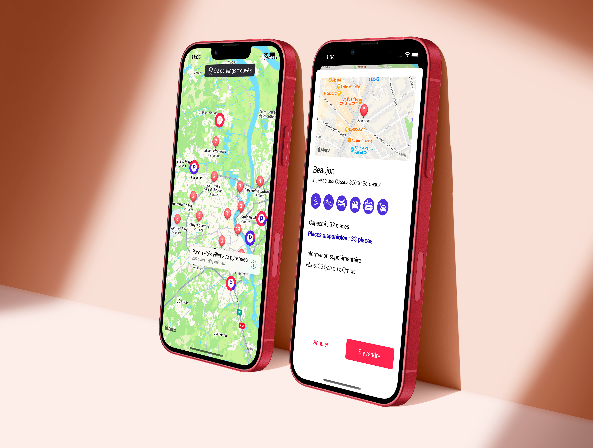

# ParkInBordeaux project
## ParkInBordeaux :  the fastest way to park your vehicle in Bordeaux

Have you ever been in Bordeaux looking for a car park for ages because the one you used to park your vehicle in was full? Driving around the city again and again, hopping the car park you are going to will have even just a tiny little spot for your car? 
If only you could use an app to avoid this situation and save you some much time and fuel. 

We heard you and developed ParkInBordeaux.

With ParkInBordeaux you can check the existing car parks in Bordeaux Metropole, their level of occupancy, if there are spots available to charge your electric vehicle, and many other information related to the car parks in Bordeaux. All of that right in your pocket. 
From now on, no more wasted time driving around, hopeless. You need a car park, open ParkInBordeaux, look for a car park matching your needs, click on the direction button to get the direction from your current position and that’s it! All of this at a glance.

Enjoy ParkInBordeaux and drive safely

## Additional information
* Support several iOS device screen sizes (from iPod touch 7th Gen to iPhone 14 Pro models)
* Dark mode support
